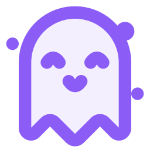

<div align="center">
  
  
  # GhostCompute
  
  **Enterprise-Grade Peer-to-Peer Remote Compute Client & Host**
  
  [](LICENSE)
  [](https://tauri.app/)
  [](https://reactjs.org/)
  [](https://www.rust-lang.org/)
</div>

---

GhostCompute is a highly secure, enterprise-level application designed to bridge the gap between local devices and powerful remote compute clusters. Built with a focus on seamless, zero-config pairing and encrypted tunneling, GhostCompute securely exposes local AI models (such as Ollama) to authorized clients without sacrificing performance or privacy.

Whether you are configuring a workstation to act as a **Host** or connecting a remote laptop as a **Client** to offload compute, the setup process is intuitive, fast, and entirely decentralized.

## Features

- **End-to-End Encryption**
  Leverages the Noise Protocol Framework (XX_25519) for military-grade cryptographic handshakes. Connections are fully authenticated and encrypted by default, ensuring your compute traffic is secure against interception.

- **WebSocket Transport Integration**
  Full support for native LAN P2P connections and Cloudflare Tunnels via WebSocket (`ws://` and `wss://`). GhostCompute can bypass traditional NAT and strict firewall restrictions natively.

- **Manual and Automated Pairing**
  Easily establish trust between devices using simple LAN Pairing Codes, or explicitly define Cloudflare Tunnel URLs for remote WAN connectivity through a premium user interface.

- **Ollama Proxy Architecture**
  Securely reverse-proxy traffic from a local client device to a robust Host running Ollama. AI workloads can be executed on powerful remote hardware while feeling entirely local to the user.

- **Enterprise-Grade User Interface**
  A sophisticated, dark-themed user interface built with React, Vite, and custom CSS variables. GhostCompute avoids bloated UI frameworks in favor of a lean, highly responsive, and premium aesthetic.

---

## Technical Architecture

- **Core Engine:** [Rust](https://www.rust-lang.org/) (Prioritizing memory safety and concurrency)
- **Framework:** [Tauri v2](https://tauri.app/) (Delivering lightweight, cross-platform app binaries)
- **Frontend:** [React](https://react.dev/) coupled with [Vite](https://vitejs.dev/)
- **Networking:** `tokio-tungstenite` and `rust-noise` (Noise Protocol)
- **Styling:** Vanilla CSS powered by modern CSS tokenization

---

## Getting Started

### Prerequisites

Ensure the following tools are available in your environment before building from source:
- [Node.js](https://nodejs.org/) (v18 or higher)
- [Rust Toolchain](https://www.rust-lang.org/tools/install)
- [Tauri CLI Dependencies](https://tauri.app/v1/guides/getting-started/prerequisites)

### Installation

Clone the repository and install the required frontend dependencies:

```bash
git clone https://github.com/John-Varghese-EH/GhostCompute.git
cd GhostCompute
npm install
```

### Development

To start the local development server and run the Tauri application:

```bash
npm run tauri dev
```

### Production Build

To compile a highly optimized, production-ready binary for your operating system:

```bash
npm run tauri build
```

---

## Usage Guide

1. **Select Operation Mode**
   Upon launching GhostCompute, the Setup Wizard will prompt you to select a mode.
   - **Host:** Expose your machine's local compute power (e.g., Ollama instances).
   - **Client:** Connect to a remote Host to offload intensive tasks.
   - **Both:** Enable both functionalities concurrently.

2. **Pairing Devices**
   - **LAN Network:** Generate a one-time pairing code on the Host and input it into the Client to establish trust.
   - **WAN Network (Cloudflare):** Navigate to the **Manual Connect** tab to input your Cloudflare Tunnel WebSocket URL (e.g., `https://my-tunnel.trycloudflare.com`).

---

## Support and Contributions

GhostCompute is an open-source labor of love, built to decentralize and secure the future of remote AI compute. If you find this software valuable in your daily workflow or enterprise environment, please consider supporting its ongoing development.

- **Star the Repository:** A simple star on GitHub helps increase visibility.
- **Report Issues:** If you encounter bugs or have feature requests, please open an issue in the issue tracker.
- **Contribute:** Pull requests are always welcome. Whether it's fixing a typo, improving documentation, or adding a new feature, your contributions matter.

---

## Author Credits

**John Varghese (J0X)**
*Architecture, Design, and Development*

- LinkedIn: [/in/John--Varghese](https://linkedin.com/in/John--Varghese/)
- GitHub: [John-Varghese-EH](https://github.com/John-Varghese-EH)

<div align="center">
  <br/>
  <sub>© 2026 John Varghese (J0X) - All Rights Reserved.</sub>
</div>
