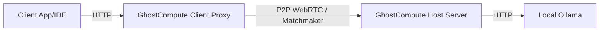

# Architecture

GhostCompute bridges the gap between a high-performance compute node (Host) and an everyday laptop (Client). Instead of relying on traditional HTTP port forwarding or vulnerable public endpoints, GhostCompute implements a secure Peer-to-Peer (P2P) WebRTC tunnel for raw, encrypted data transmission.

## High-Level Topology

## The AI Gateway (Client-Side)
To provide resilience, GhostCompute incorporates a Client-Side AI Gateway. 

1. **Request Interception**: The Client Proxy (running at `http://127.0.0.1:11434`) intercepts all HTTP requests.
2. **Model Aggregation**: When querying `/v1/models`, the Gateway queries the Host over P2P for local Ollama models. It then dynamically appends Gemini and Groq models (if API keys are provided in settings) and returns the combined list to your IDE.
3. **Cloud Fallback**: When receiving a `/v1/chat/completions` request:
    - If the requested model is a Cloud model (e.g., `gemini-1.5-pro` or `groq:llama3-70b-8192`), the Client Gateway routes the request directly to Google/Groq APIs over the public internet, completely bypassing the P2P Host.
    - If the Host goes offline, Cloud models remain fully functional because the routing logic exists on the Client.

## P2P Communication
- **Signaling**: Initial handshakes are facilitated via a signaling server (using WebSockets).
- **Transport**: Once established, WebRTC data channels carry the HTTP proxy payloads securely and natively.
- **Latency**: Because WebRTC establishes direct peer-to-peer connections (using STUN/TURN if necessary), latency is minimized compared to relaying through a centralized proxy.
